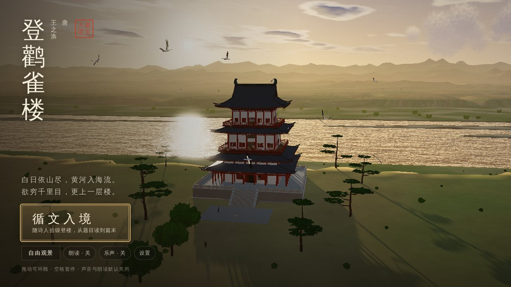
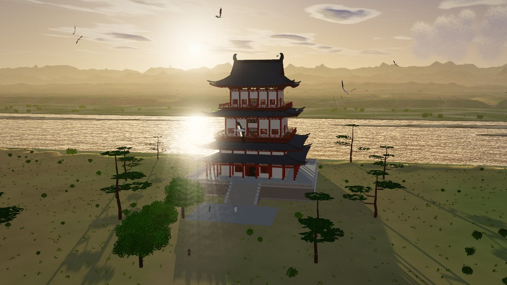
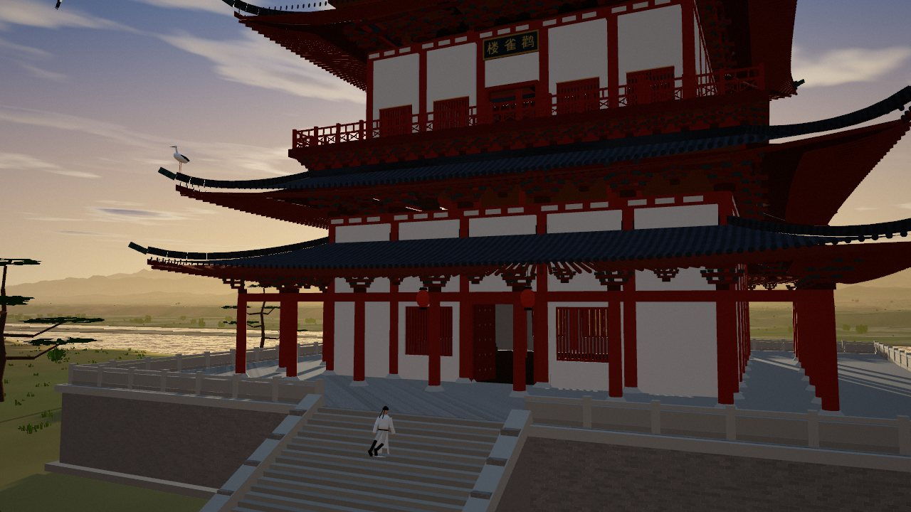
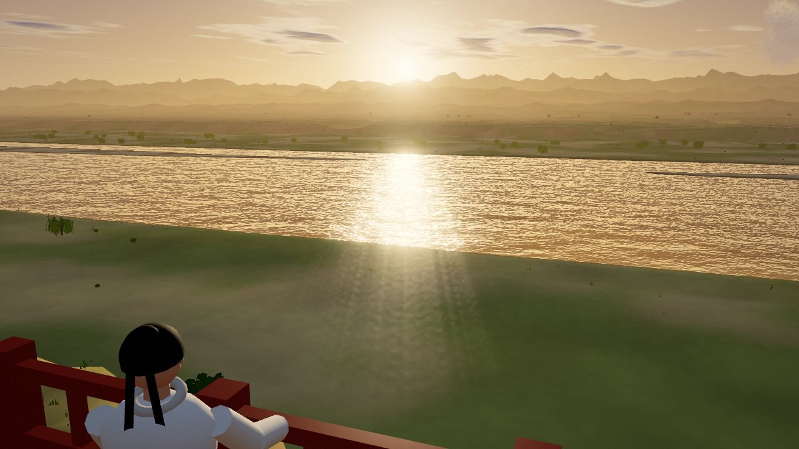
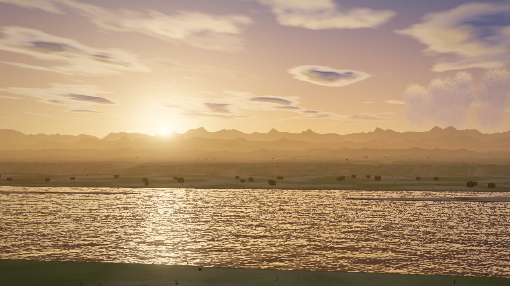
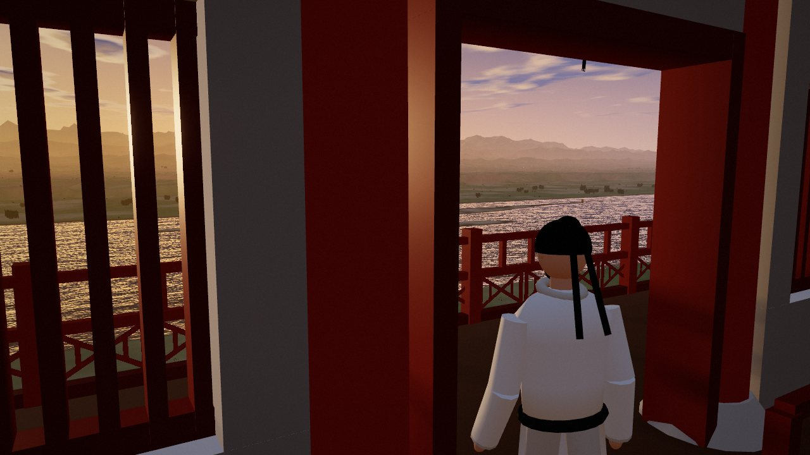
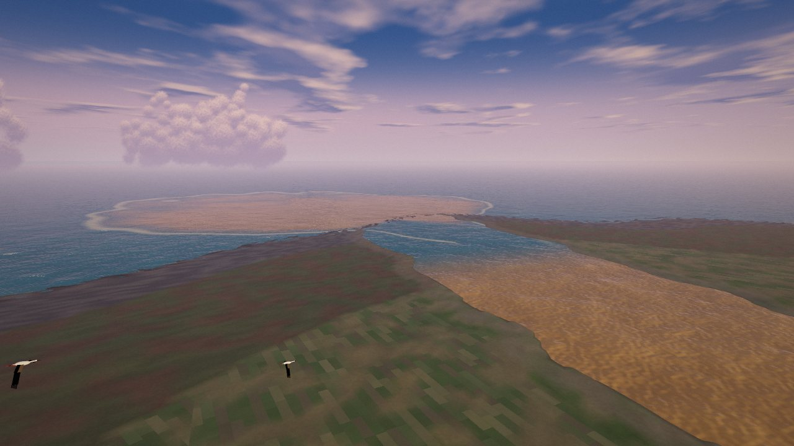
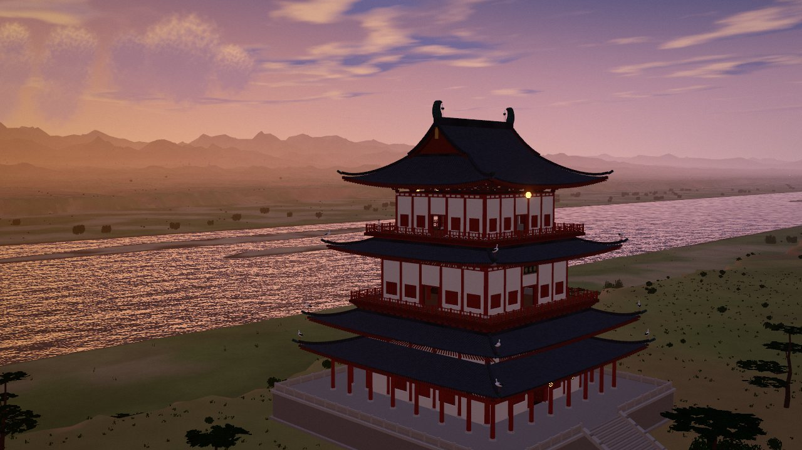
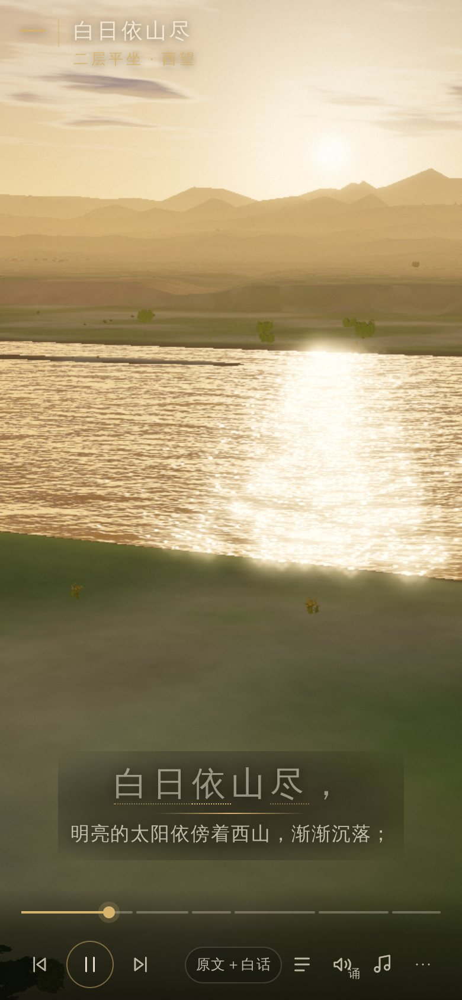
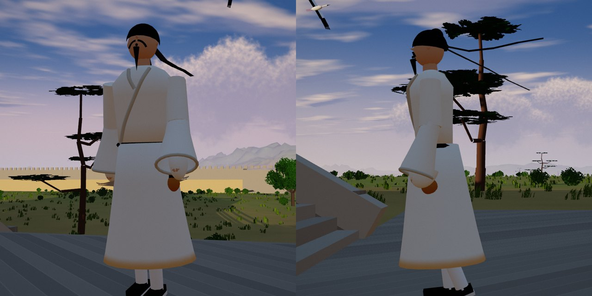

# 登鹳雀楼 · 循文入境

唐 · 王之涣《登鹳雀楼》的可交互 3D 文学场景。全部画面由 WebGL 实时程序化生成（地形、黄河、天空、鹳雀楼、草木、鸟、人物），不使用任何照片、全景图或视频。

> 白日依山尽，黄河入海流。欲穷千里目，更上一层楼。



## 打开方式

- 在线访问：https://leosun111.github.io/agent-quota-watch/ （GitHub Pages，来自仓库 `docs/`，由 `node build.mjs` 生成；含 `private/` 中的朗诵音轨时一并发布为 `docs/recitation.mp3`）。
- 直接双击 `dist/deng-guanque-lou.html`（单文件，约 1 MB，three.js 与全部脚本已内嵌），离线可用。
- 需要支持 WebGL2 的现代浏览器（Chrome / Edge / Safari 15+ / Firefox）。
- 标题字体来自 Google Fonts；离线时自动回退到系统宋体/楷体，不影响功能。
- 画质：桌面默认「高」，手机/小屏默认「轻」；可在「设置」中切换，或 URL 加 `?q=high` / `?q=light`。

## 体验结构

| 章 | 时长 | 内容 |
|---|---|---|
| 序 · 登楼 | 27 s | 第三人称：蒲州城西、黄河东岸，诗人来到楼下，拾级登楼 |
| 一 · 白日依山尽 | 18 s | 二层平坐，凭栏西望，夕阳贴着中条山/西岭缓缓沉落 |
| 二 · 黄河入海流 | 22 s | 俯瞰楼下大河，镜头顺流东去 |
| 三 · 欲穷千里目 | 16 s | 远方渐入暮霭，鹳雀掠过，诗人仍想看得更远 |
| 四 · 更上一层楼 | 34 s | 转身入楼，沿楼梯登上顶层，走到栏边 |
| 五 · 千里 · 心象 | 30 s | 想象之景（非目力所及）：随大河东去，直到黄河入海口 |
| 尾 · 余晖 | 20 s | 日落后，城中灯火初上，鹳雀归巢 |

## 操作

- **循文入境**：落地页主按钮。两种节奏——「连贯体验」自动走完；「逐章慢读」每章结束停下，点「继续」进入下一章。
- 底栏：上一章 / 暂停继续 / 下一章、可拖动进度条、节奏、字幕模式（原文＋白话 / 只看原文 / 只看白话）、目录、朗读、乐声、更多。
- 导览中可随时拖动环视，不会退出导览；「回正视角」恢复导演镜头。
- 字幕中带下划线的词可点开注释；场景中的楼、河、山、城、鹳雀等可点击查看说明。
- 「更多」：回正视角、隐藏界面、保存当前画面（PNG）、暂停动态、设置、退出导览（自由观景）。
- 自由观景：鼠标拖动旋转、滚轮/双指缩放、多个预设视点、时辰（夕照/日落/暮色）。
- 键盘：`空格` 暂停/继续，`← →` 上一章/下一章，`T` 目录，`R` 回正，`H` 隐藏/显示界面，`Esc` 关闭弹层或恢复界面。
- 系统开启「减少动态效果」时（或在「设置」中勾选），导览镜头改为分段定格、以柔和淡入淡出衔接，并关闭镜头呼吸与胶片颗粒；「暂停动态」可冻结水面、草木与飞鸟。

## 声音

- **乐声与朗读默认开启**。浏览器要求先有一次点击或按键才能出声，因此两者在访客第一次点击（例如点「循文入境」）时开始播放；若第一下点的就是「朗读」或「乐声」按钮，则视为关闭该项。
- 朗读使用浏览器自带的中文语音，逐句朗读，字幕按句高亮（只做句级同步，不声称逐字）。设备无中文语音时会如实提示，并可继续无声体验。
- 可在「设置 → 载入朗诵音频」导入自己有权使用的朗诵录音，页面会按停顿自动切分为「标题＋四句」并与章节同步。录音只保存在本浏览器（IndexedDB），下次打开会记住，开启朗读时自动使用，「清除」可删除。页面不附带任何第三方录音。
- 乐声为实时合成的古风配乐（古筝拨弦、箫、低音持续音、风声水声），音量较低，朗读时自动压低。
- 不需要任何 API Key。

### 内置朗诵音轨（本地构建）

仓库不包含任何录音。若你有权使用某段朗诵或歌唱录音，可把它放进 `private/`（已被 git 忽略）后构建一个内置音轨的版本：

```
private/recitation.mp3
private/recitation.json   # 每句的起止秒数
```

```json
{
  "name": "登鹳雀楼（歌唱版）",
  "fadeIn": 0.45, "fadeOut": 0.9, "gain": 0.85,
  "title": [0.0, 14.3],
  "lines": [[14.5, 20.3], [21.1, 27.0], [27.7, 33.7], [34.1, 40.3]],
  "verse": [[40.7, 47.4], [47.4, 54.0], [54.0, 60.3], [60.3, 66.3]]
}
```

- `title`：序章播放的片段（可为片头音乐）；`lines`：第一至四章各播一句；`verse`（可选）：第五章把四句作为一段连续演唱播放，字幕按每句起点切换。
- 片段首尾自动淡入淡出，适合带伴奏的歌唱版。
- `node build.mjs` 会额外输出 `dist/private/deng-guanque-lou.html`（同样被 git 忽略）。

## 开发

```bash
node build.mjs          # src/ → dist/deng-guanque-lou.html 与 dist/artifact.html
```

- `src/js/` 按编号顺序拼接：`00` 配置与诗文 → `1x` 世界（地形/天空/水/楼/植被/城/鸟/人物/想象之景）→ `2x` 环境与后期 → `3x` 分镜、导演镜头、叙事时间线 → `4x` 声音与朗读 → `50` 界面 → `90` 主循环。
- `tools/` 为基于 Playwright（Chromium + SwiftShader）的自测脚本：
  - `tourshots.mjs` 按「章:秒」截图；`uishots.mjs` 走一遍界面（加 `1` 为手机模式）；
  - `scan.mjs` 检查全程镜头是否穿模；`timeline.mjs` 验证连贯/逐章节奏；`audiotest.mjs`、`soundtest.mjs` 验证音频切分与配乐电平。

## 说明与局限

- 诗人形象：乳白交领右衽宽袖长袍、细腰带挂酒葫芦、黑幞头长软脚随风飘动、八字胡与山羊须、灰裤白袜黑布鞋；为程序化的风格化造型，参考国风动画的服饰气质，并非复刻任何影片角色。
- 鹳雀楼按唐代楼阁形制（三层四檐、歇山顶、斗拱、勾栏、朱柱白壁）参照今永济复建楼及唐代建筑资料程序化建模，是艺术再现而非考古复原。
- 诗句写的是「黄河入海流」，第五章展开的是**黄河**入海口。它远在千里之外，登楼并不能真正看到，因此画面明确标注为「想象之景」。
- 画风借鉴《长安三万里》一类国风动画的暖金夕照与大气透视，仅为风格参考，不含任何该片素材。
- 在无 GPU 的无头 Chromium（SwiftShader）中完成了功能与画面自测；真实 GPU 上的帧率、各平台的中文语音音色、配乐的实际听感、iOS Safari 细节未能在此环境中验证。

## 截图

| | |
|---|---|
|  |  |
|  |  |
|  |  |
|  |  |



three.js 以 MIT 许可内嵌，见 `vendor/THREE-LICENSE`。
